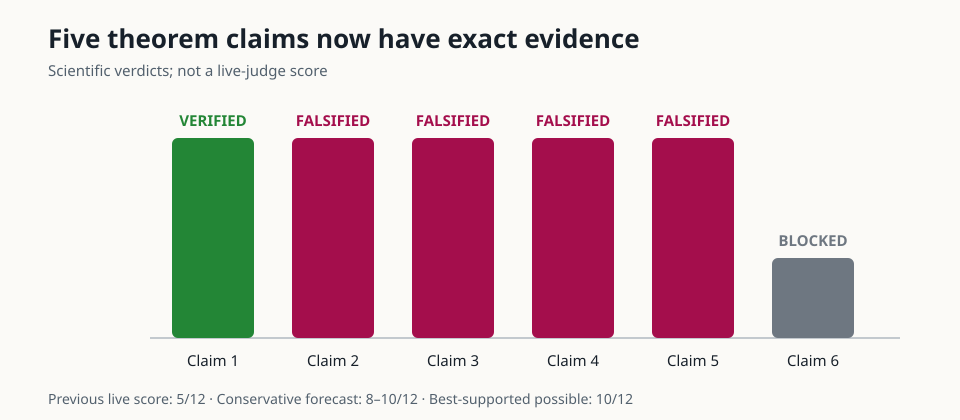
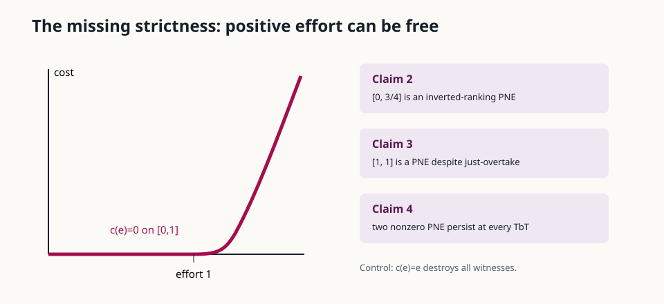
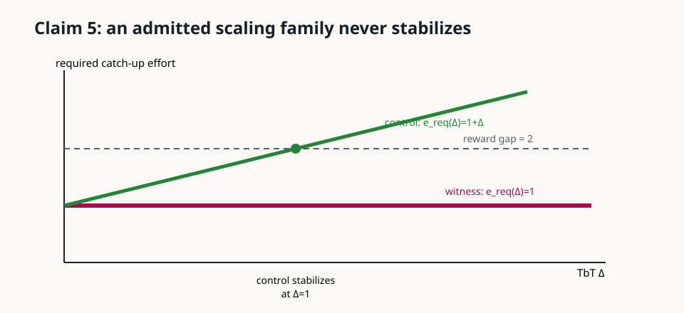
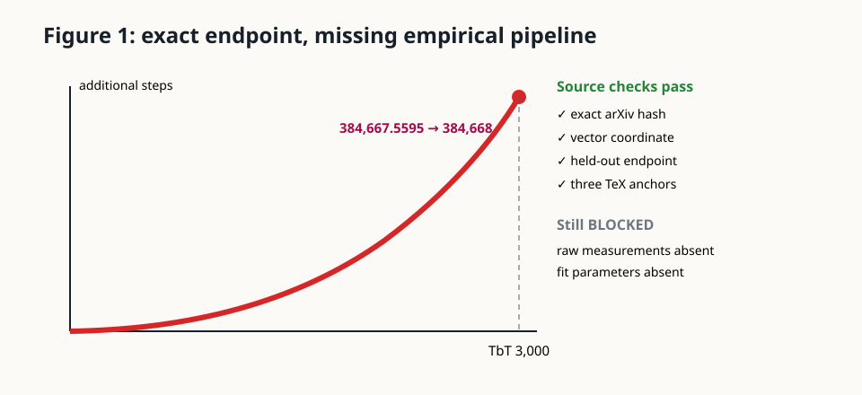

# Exact Incentives, Missing Data



This reproduction asks a simple question: can leaderboard rewards make model
developers keep “just overtaking” one another, and can tune-before-test (TbT)
stabilize that competition? The original logbook used a three-player numerical
game. It was useful intuition, but its finite sweeps could not settle universal
theorems. We replaced those sweeps with continuous-domain proof obligations and
assumption-satisfying counterexamples.

The result is mixed and more informative than a blanket confirmation. Claim 1
has an exact no-equilibrium witness. Claims 2–5 are falsified under their written
assumptions. The displayed number in Figure 1 reconstructs exactly, but its
underlying Winogrande training data and fit parameters are unavailable, so
claim 6 remains BLOCKED.

## What changed

The fixed command is identical on every experiment:

```bash
uv run --frozen python repro/src/verify.py
```

It first retains the original finite sweeps as `TOY_PASS` regressions. It then
runs Z3 obligations over real-valued efforts, writes raw JSON, checks that JSON
with separately implemented readers, downloads the exact hashed arXiv source,
and reconstructs Figure 1.

| Claim | Paper result | Observed result | Assessment | Compute |
| --- | --- | --- | --- | --- |
| 1 | No PNE generally exists | every continuous effort profile in one admitted game has a profitable deviation | VERIFIED | local, 0.02 s theorem suite |
| 2 | every PNE preserves capability order | admitted PNE `[0,3/4]` strictly inverts the order | FALSIFIED | local |
| 3 | just-overtake implies no PNE | admitted PNE `[1,1]` exists while `0 < 0.1` satisfies the antecedent | FALSIFIED | local |
| 4 | TbT yields a unique stable PNE | two nonzero PNE persist for every TbT level | FALSIFIED for aggregate uniqueness; Proposition 5.3 alone is not contradicted | local |
| 5 | stabilizing threshold exists and is polynomial | an admitted generalized-logit family has constant catch-up effort one, so reward gap two never stabilizes | FALSIFIED | local |
| 6 | 384,668 additional Winogrande steps at TbT 3,000 | vector source gives 384,667.5595, but raw training data and fit parameters are absent | BLOCKED | local, 0.53 s |

## Why the equilibrium proofs break



The paper assumes cost is non-decreasing and convex—not strictly increasing.
The function

```text
c(e) = max(e - 1, 0)^2
```

therefore qualifies, even though every effort through one is free. With
`v(theta,e)=1-exp(-(theta+e))`, this single allowed flat interval exposes three
different failures:

- Equal rewards make `[0,3/4]` a maximum-utility PNE while the weaker model
  strictly outranks the stronger one (claim 2).
- With rewards `[0.1,0]`, `[1,1]` is a PNE even though the baseline
  just-overtake cost is zero (claim 3).
- Since common TbT cancels from comparisons of `theta+Delta+e`, `[1,0]` and
  `[1,1]` remain distinct PNE for every nonnegative `Delta` (claim 4).

The paper proof says a last-ranked model can *weakly* improve by reducing
effort, then concludes its equilibrium effort *must* be zero. That conclusion
needs strictness. The linear-cost control destroys every witness as intended.

## A scaling-law counterexample



Claim 5 fails for a different reason. Consider

```text
v(theta,e) = 1 - 1 / (2 + e + theta),    theta in [0,1].
```

This is exactly the paper’s generalized-logit form with `U=1`,
`L(theta)=theta/(1+theta)`, `alpha(theta)=-log(1+theta)`, and `beta=1`.
It is strictly increasing in capability, increasing/concave/saturating in
effort, and has non-decreasing effort gaps. Between capabilities one and zero,
the lower model needs additional effort strictly greater than one at *every*
TbT level. With `c(e)=e` and reward gap two, no finite TbT level can make the
overtake cost reach the reward gap.

There is an interpretation caveat: an earlier paragraph describes monotone
`alpha(theta)` as a sufficient condition, although Proposition 5.6 does not
state it and the counterexample satisfies the inherited C1–C3 assumptions
directly. Under an added monotone-alpha/common-bound restriction, the control
has `e_req(Delta)=1+Delta` and stabilizes at `Delta=1`.

## What Figure 1 does and does not establish



The right-panel PDF in the hashed arXiv source has one red 30-segment path. Its
labeled tick geometry maps the endpoint to 384,667.5595 at TbT 3,000, which
rounds to 384,668. Holding out that endpoint and extrapolating from the preceding
30 vector points predicts 384,648.80; three separate TeX anchors also agree.
A deliberately wrong 350,000 axis maximum decodes 336,584 and fails.

These checks rigorously reproduce the *published display*. They cannot rerun the
empirical fit: the source bundle contains no per-checkpoint Winogrande
measurements, fit parameters, training code, or checkpoints. Full five-model
fine-tuning would also exceed this CPU-only campaign and would not recover the
authors’ undisclosed data choices. Claim 6 is therefore BLOCKED, not VERIFIED.

## Evidence and reproducibility

- Raw theorem certificate: [`outputs/exact_theory.json`](../../outputs/exact_theory.json)
- Raw Figure 1 reconstruction: [`outputs/claim6_reconstruction.json`](../../outputs/claim6_reconstruction.json)
- Exact verifier: [`repro/src/exact_theory.py`](../../repro/src/exact_theory.py)
- Figure verifier: [`repro/src/claim6_figure.py`](../../repro/src/claim6_figure.py)
- Independent checkers: [`repro/src/check_exact_theory.py`](../../repro/src/check_exact_theory.py) and [`repro/src/check_claim6.py`](../../repro/src/check_claim6.py)
- Pinned environment: [`uv.lock`](../../uv.lock)

No stochastic seeds are used. The winning cumulative formal run used 0.991 mean
CPU core for the theorem checks and 0.096 mean CPU core for the 0.53-second
Figure route. All formal compute was local because each task was estimated at
one core and under five minutes; no GPU or Hugging Face compute was used.

## Assessment

Previous live judged score: **5/12**. The conservative projected range after
publication is **8–10/12**. The best-supported possible score is **10/12**, a
forecast rather than a judge result.

| Claim | Current points | Possible points | Confidence | Evidence status | Basis and remaining risk |
| --- | ---: | ---: | --- | --- | --- |
| 1 | 1 | 2 | HIGH | VERIFIED | exhaustive continuous-domain witness; existential scope is source-consistent |
| 2 | 1 | 2 | HIGH | FALSIFIED | exact inverted PNE satisfies written reward, cost, and score assumptions |
| 3 | 1 | 2 | HIGH | FALSIFIED | exact PNE satisfies the theorem antecedent; proof strictness gap is explicit |
| 4 | 1 | 2 | MEDIUM | FALSIFIED | aggregate uniqueness fails; formal Proposition 5.3 alone remains true in scope |
| 5 | 1 | 2 | MEDIUM | FALSIFIED | literal statement and C1–C3 admit the witness; implicit monotone-alpha reading is a risk |
| 6 | 0 | 0 | LOW | BLOCKED | four source routes completed; raw empirical inputs remain unavailable |

Only a live judge can change the score. Claim 6 would be unblocked by the
authors’ per-checkpoint measurements and fit configuration, or published
CPU-feasible logits/checkpoints sufficient to recreate them.
